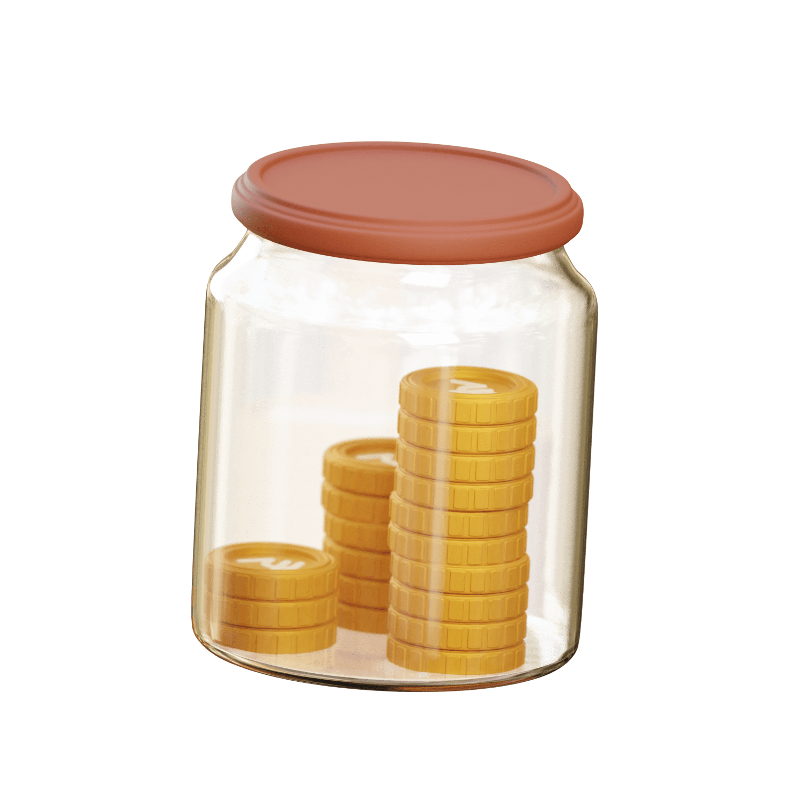
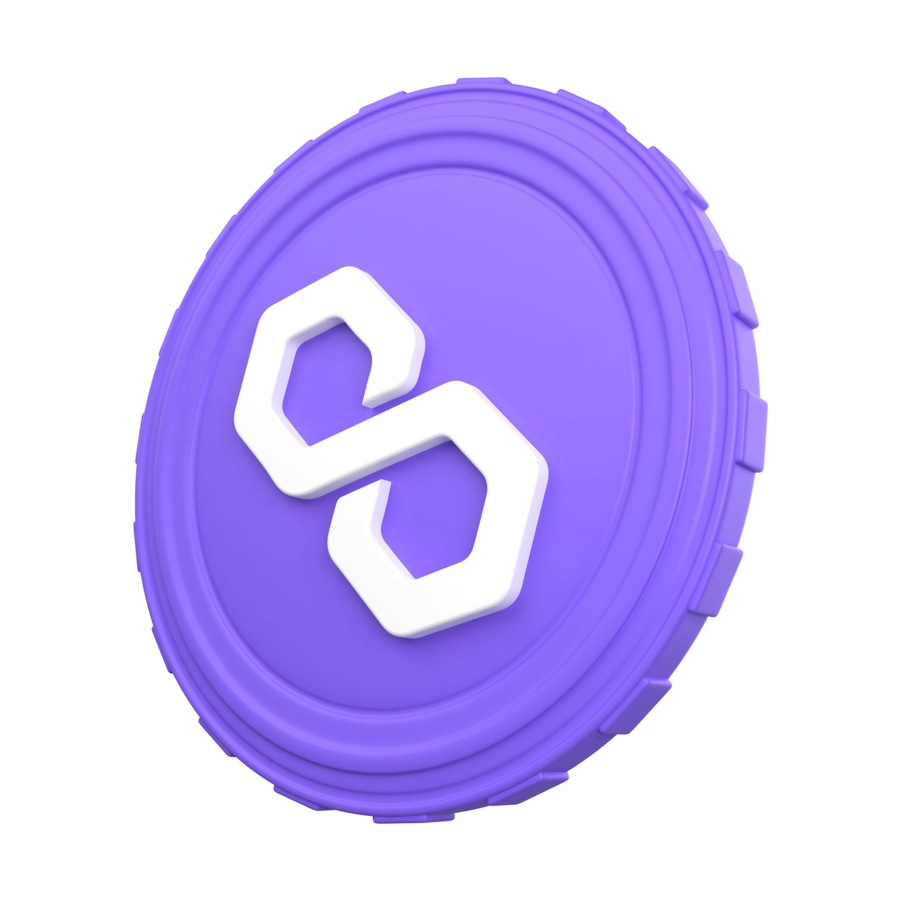
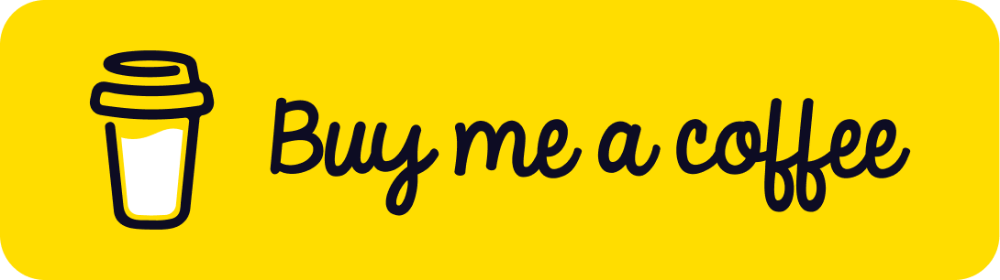

<h1 style="text-align:center;display:inline-block;">Hi there</h1>

I'm Jonas and I'm from Cologne, Germany ✌️

I'm a passionate bot programmer, meaning I love to automate work that takes me 10 minutes to do by creating a solution
that takes me a day to make 🥴

 
 
 
 
 
 

[//]: # "Linkedin"

<a href="https://www.linkedin.com/in/jonas-lieske-aa965b1bb/">

Jonas Lieske

</a>
 

[//]: # "Instagram"

<a href="https://www.instagram.com/jonas.lieske/">

@jonas.lieske

</a>
 

[//]: # "Discord"

<a href="discordapp.com/users/282623078410747904">

Schubber#4242

</a>

  

[//]: # "Bitcoin"

<code>bc1q09767674z8vmu3mge2au7zz7d8p905k4tf9xt2</code>

 

[//]: # "Bitcoin"

<code>0x276370C0086ECD7E34ABc3a8FF0ad4e24D711c66</code>

[//]: # "Fiat"

  

